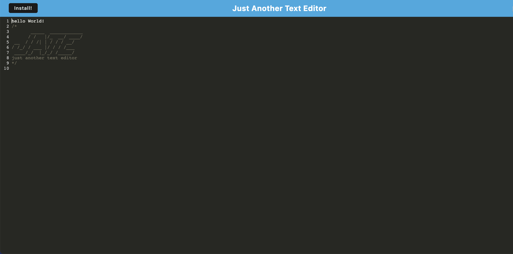

# Just Another Text Editor - PWA

## Table of Contents
- [Project Description](#project-description)
- [Installation](#installation)
- [Usage](#usage)
- [License](#license)
- [Questions](#questions) 

## Project Description
An offline-capable text-editor app.

## Installation 
To run the app locally:
1. Clone the repository.
2. Run `npm install` from the project directory in your terminal.
3. Run 'npm run build' from the project directory in your terminal.
4. Open your web browser and navigate to http://localhost:3000 to see the text editor in action.

To install the app from the live URL:
1. Visit the live URL of the app.
2. Click the install button and follow your browser prompts.

## Usage 
Visit the live application URL and start typing notes.

[Click Here to Visit the Live Application](https://fierce-ravine-25733-fb3788a86339.herokuapp.com/)

## License
This project is licensed under the MIT license.

## Questions
For more information, you can reach out to:

GitHub: [jeremytboyer](https://github.com/jeremytboyer)

Email: [jeremytboyer@gmail.com](mailto:jeremytboyer@gmail.com)
